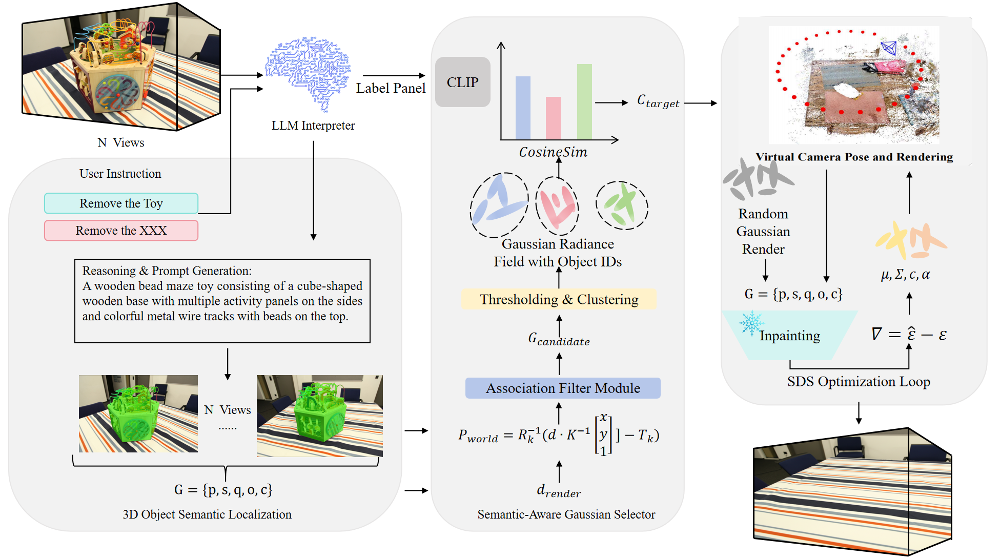

# OVR-GS: Training-Free Open-Vocabulary 3D Object Removal via Gaussian Splatting

[](https://www.mdpi.com/journal/electronics)
[](https://www.python.org/)
[](LICENSE)

> **OVR-GS** is a training-free framework for open-vocabulary 3D object removal and inpainting built upon 3D Gaussian Splatting (3DGS). Given a natural-language instruction (e.g., *"remove the red cone"*), OVR-GS automatically localizes, removes, and inpaints the target object in 3D — without any scene-specific fine-tuning.

<p align="center">
  
</p>

---

## 📋 Table of Contents

- [Overview](#overview)
- [Environment Setup](#environment-setup)
- [Data Preparation](#data-preparation)
- [Quick Start](#quick-start)
- [Full Pipeline](#full-pipeline)
  - [Stage 0: 3DGS Scene Reconstruction](#stage-0-3dgs-scene-reconstruction)
  - [Stage 1: Language-Driven Segmentation](#stage-1-language-driven-segmentation)
  - [Stage 2: Semantic-Aware Gaussian Selection (SAGS)](#stage-2-semantic-aware-gaussian-selection-sags)
  - [Stage 3: Generative 3D Inpainting via SDS](#stage-3-generative-3d-inpainting-via-sds)
- [Evaluation](#evaluation)
- [Pretrained Checkpoints](#pretrained-checkpoints)
- [Project Structure](#project-structure)
- [Citation](#citation)
- [Acknowledgements](#acknowledgements)

---

## Overview

OVR-GS consists of three tightly coupled stages:

| Stage | Module | Description |
|-------|--------|-------------|
| **1** | LLM + Grounded-SAM + CLIP | Parse user instruction → multi-view 2D segmentation with semantic verification |
| **2** | SAGS (Semantic-Aware Gaussian Selector) | Lift 2D masks → 3D via depth back-projection, DBSCAN clustering, CLIP render-and-verify |
| **3** | SDS-based Generative 3D Inpainting | Initialize learnable Gaussians in void → optimize via Score Distillation Sampling |

---

## Environment Setup

### 1. Clone Repository

```bash
git clone https://github.com/3171228612/OVR-GS.git
cd OVR-GS
```

### 2. Create Conda Environment

```bash
conda create -n tfovor python=3.9 -y
conda activate tfovor

# PyTorch (CUDA 11.8)
pip install torch==2.1.0 torchvision==0.16.0 --index-url https://download.pytorch.org/whl/cu118

# 3D Gaussian Splatting dependencies
pip install submodules/diff-gaussian-rasterization
pip install submodules/simple-knn
```

### 3. Install Core Dependencies

```bash
pip install -r requirements.txt
```

<details>
<summary><b>Key packages in requirements.txt</b></summary>

```
numpy>=1.24
opencv-python>=4.8
Pillow>=10.0
scipy>=1.11
scikit-learn>=1.3          # DBSCAN clustering
open3d>=0.17               # point cloud utilities
trimesh>=4.0
plyfile>=1.0
tqdm>=4.65

# Vision-Language Models
transformers>=4.36
openai-clip>=1.0           # CLIP verification
segment-anything @ git+https://github.com/facebookresearch/segment-anything.git

# Diffusion & SDS
diffusers>=0.25
accelerate>=0.25

# Evaluation
lpips>=0.1.4
pytorch-fid>=0.3
```

</details>

### 4. Download Pretrained Model Weights

```bash
# Grounding DINO
mkdir -p checkpoints && cd checkpoints
wget https://github.com/IDEA-Research/GroundingDINO/releases/download/v0.1.0-alpha2/groundingdino_swinb_cogcoor.pth

# HQ-SAM
wget https://huggingface.co/lkeab/hq-sam/resolve/main/sam_hq_vit_h.pth

# CLIP (auto-downloaded on first run)
# Stable Diffusion v1.5 Inpainting (auto-downloaded from HuggingFace)
cd ..
```

---

## Data Preparation

### Supported Datasets

| Dataset | Scenes | Type | Download |
|---------|--------|------|----------|
| **SPIn-NeRF** | 10 | Front-facing | [Link](https://spinnerf3d.github.io/) |
| **IMFine** | 20 | Multi-trajectory (90°/180°/360°) | [Link](https://github.com/Zhihao-Shi/IMFine) |
| **OVR-GS-360** | 12 | Full 360° | Included in `data/` |

### Data Structure

```
data/
├── tfovor/                     # OVR-GS-360 dataset (included)
│   ├── bag/
│   │   ├── images/             # Full-resolution images
│   │   ├── images_2/           # 2x downsampled
│   │   ├── images_4/           # 4x downsampled
│   │   ├── images_8/           # 8x downsampled
│   │   ├── sparse/             # COLMAP sparse reconstruction
│   │   │   └── 0/
│   │   │       ├── cameras.bin
│   │   │       ├── images.bin
│   │   │       └── points3D.bin
│   │   ├── unseen_mask/        # Object masks for removal
│   │   ├── raw_hqsam/          # HQ-SAM raw masks
│   │   ├── raw_hqsam_color/    # Colorized mask visualization
│   │   ├── associated_hqsam/   # Associated mask patches
│   │   └── associated_hqsam_color/
│   ├── cube/
│   ├── toys/
│   ├── doppelherz/
│   ├── truck/
│   └── ...
├── spinnerf/                   # SPIn-NeRF (download separately)
└── imfine/                     # IMFine (download separately)
```

### Prepare Your Own Scenes

```bash
# 1. Capture multi-view images (recommend 100-200 views for 360° scenes)
# 2. Run COLMAP for camera calibration
python scripts/colmap_preprocess.py \
    --image_dir data/tfovor/your_scene/images \
    --output_dir data/tfovor/your_scene/sparse

# 3. Generate multi-resolution copies
python scripts/generate_multiscale.py \
    --input data/tfovor/your_scene/images \
    --factors 2 4 8
```

---

## Quick Start

Run the full OVR-GS pipeline with a single command:

```bash
python run_tfovor.py \
    --scene data/tfovor/bag \
    --instruction "remove the bag" \
    --output output/bag_removed \
    --gpu 0
```

This will automatically execute all three stages and produce the edited 3DGS scene.

---

## Full Pipeline

### Stage 0: 3DGS Scene Reconstruction

First, reconstruct the initial 3DGS scene from multi-view images.

```bash
python train_3dgs.py \
    --source_path data/tfovor/bag \
    --model_path output/bag/3dgs_base \
    --resolution 2 \
    --iterations 30000 \
    --sh_degree 3 \
    --densify_until_iter 15000 \
    --densification_interval 100
```

**Expected output:** `output/bag/3dgs_base/point_cloud/iteration_30000/point_cloud.ply`

### Stage 1: Language-Driven Segmentation

Parse user instruction and generate multi-view 2D masks.

#### Step 1.1: LLM Instruction Parsing

```bash
python tfovor/stage1_parse_instruction.py \
    --instruction "remove the bag" \
    --output_queries output/bag/queries.json
```

This produces expanded queries, e.g., `["bag", "backpack", "satchel", "handbag"]`.

#### Step 1.2: Grounded-SAM Mask Generation

```bash
python tfovor/stage1_grounded_sam.py \
    --image_dir data/tfovor/bag/images \
    --queries output/bag/queries.json \
    --sam_ckpt checkpoints/sam_hq_vit_h.pth \
    --gdino_ckpt checkpoints/groundingdino_swinb_cogcoor.pth \
    --output_dir output/bag/raw_masks \
    --box_threshold 0.25 \
    --text_threshold 0.20
```

#### Step 1.3: CLIP Semantic Verification

```bash
python tfovor/stage1_clip_filter.py \
    --image_dir data/tfovor/bag/images \
    --mask_dir output/bag/raw_masks \
    --queries output/bag/queries.json \
    --output_dir output/bag/verified_masks \
    --clip_threshold 0.25
```

**Expected output:** Filtered 2D binary masks in `output/bag/verified_masks/`.

### Stage 2: Semantic-Aware Gaussian Selection (SAGS)

Lift 2D masks into 3D and identify the target Gaussian subset.

#### Step 2.1: Mask Association & Depth Back-Projection

```bash
python tfovor/stage2_mask_association.py \
    --scene_path data/tfovor/bag \
    --model_path output/bag/3dgs_base \
    --mask_dir output/bag/verified_masks \
    --output_dir output/bag/associated_hqsam \
    --patches 16 \
    --gs_iou_threshold 0.2
```

#### Step 2.2: DBSCAN Clustering + CLIP Render-and-Verify

```bash
python tfovor/stage2_sags_select.py \
    --model_path output/bag/3dgs_base \
    --associated_mask_dir output/bag/associated_hqsam \
    --queries output/bag/queries.json \
    --output_path output/bag/target_gaussians.json \
    --dbscan_eps 0.10 \
    --dbscan_min_samples 50 \
    --confidence_threshold 0.5
```

**Expected output:** `target_gaussians.json` containing indices of the target Gaussian subset $\mathcal{G}_{target}$.

### Stage 3: Generative 3D Inpainting via SDS

Remove target Gaussians and fill the void with SDS optimization.

#### Step 3.1: Target Removal & Void Initialization

```bash
python tfovor/stage3_remove_and_init.py \
    --model_path output/bag/3dgs_base \
    --target_gaussians output/bag/target_gaussians.json \
    --output_path output/bag/scene_with_void \
    --init_strategy boundary_and_uniform \
    --n_init_points 5000 \
    --init_opacity 0.1
```

#### Step 3.2: Virtual Camera Trajectory Generation

```bash
python tfovor/stage3_virtual_cameras.py \
    --model_path output/bag/3dgs_base \
    --target_gaussians output/bag/target_gaussians.json \
    --output_path output/bag/virtual_cameras.json \
    --n_views 12 \
    --radius_scale 0.8
```

#### Step 3.3: SDS Optimization

```bash
python tfovor/stage3_sds_inpaint.py \
    --scene_path output/bag/scene_with_void \
    --virtual_cameras output/bag/virtual_cameras.json \
    --prompt "a clean floor background" \
    --diffusion_model runwayml/stable-diffusion-v1-5 \
    --sds_iterations 500 \
    --lr 3e-5 \
    --lambda_opacity 0.01 \
    --lambda_sparsity 0.001 \
    --resolution 512 \
    --output_path output/bag/inpainted
```

#### Step 3.4: Local 3DGS Refinement

```bash
python tfovor/stage3_local_refine.py \
    --scene_path output/bag/inpainted \
    --source_images data/tfovor/bag/images \
    --iterations 300 \
    --lambda_photo 1.0 \
    --lambda_depth 0.1 \
    --output_path output/bag/final
```

**Expected output:** Final edited scene at `output/bag/final/point_cloud/point_cloud.ply`.

### Render Novel Views

```bash
python render.py \
    --model_path output/bag/final \
    --source_path data/tfovor/bag \
    --skip_train \
    --render_path output/bag/renders
```

---

## Evaluation

### Quantitative Metrics

Compute PSNR, LPIPS, and FID on held-out ground-truth views:

```bash
# PSNR & LPIPS
python eval/compute_metrics.py \
    --render_dir output/bag/renders/test \
    --gt_dir data/tfovor/bag/gt_test \
    --metrics psnr lpips

# FID
python -m pytorch_fid \
    output/bag/renders/test \
    data/tfovor/bag/gt_test
```

### Batch Evaluation on All Scenes

```bash
python eval/eval_all.py \
    --dataset tfovor \
    --data_root data/tfovor \
    --output_root output \
    --results_csv results/tfovor_results.csv
```

### Reproduce Paper Results

```bash
# SPIn-NeRF benchmark
bash scripts/run_spinnerf_all.sh

# IMFine benchmark
bash scripts/run_imfine_all.sh

# OVR-GS-360 benchmark
bash scripts/run_tfovor360_all.sh
```

---

## Pretrained Checkpoints

| Component | Model | Size | Link |
|-----------|-------|------|------|
| Grounding DINO | Swin-B | 694 MB | [Download](https://github.com/IDEA-Research/GroundingDINO/releases) |
| HQ-SAM | ViT-H | 2.6 GB | [Download](https://huggingface.co/lkeab/hq-sam) |
| Stable Diffusion | v1.5 | 4.3 GB | Auto-download via HuggingFace |
| CLIP | ViT-L/14 | 890 MB | Auto-download via OpenAI |

> **Note:** No scene-specific checkpoints are needed — OVR-GS is training-free.

---

## Project Structure

```
OVR-GS/
├── tfovor/                          # Core pipeline modules
│   ├── stage1_parse_instruction.py  # LLM instruction parsing
│   ├── stage1_grounded_sam.py       # Grounded-SAM mask generation
│   ├── stage1_clip_filter.py        # CLIP semantic verification
│   ├── stage2_mask_association.py   # Multi-view mask lifting
│   ├── stage2_sags_select.py        # DBSCAN + CLIP selection
│   ├── stage3_remove_and_init.py    # Gaussian removal & void init
│   ├── stage3_virtual_cameras.py    # Virtual trajectory generation
│   ├── stage3_sds_inpaint.py        # SDS optimization loop
│   └── stage3_local_refine.py       # Local 3DGS refinement
├── submodules/
│   ├── diff-gaussian-rasterization/ # 3DGS CUDA rasterizer
│   └── simple-knn/                  # KNN for Gaussian densification
├── scripts/                         # Utility & batch scripts
├── eval/                            # Evaluation tools
├── data/                            # Datasets (see Data Preparation)
├── checkpoints/                     # Model weights
├── output/                          # Results (auto-generated)
├── train_3dgs.py                    # 3DGS training script
├── render.py                        # Novel-view rendering
├── run_tfovor.py                    # One-click full pipeline
├── requirements.txt
└── README.md
```

---

## Hardware Requirements

| Setting | GPU Memory | Total Time |
|---------|-----------|------------|
| Single scene edit (512×512) | ~16 GB | ~58 min |
| Batch evaluation (12 scenes) | ~16 GB | ~12 hours |

Tested on: NVIDIA H800 (80 GB), A100 (40 GB), RTX 4090 (24 GB).


---

## Acknowledgements

This project builds upon several excellent open-source works:

- [3D Gaussian Splatting](https://github.com/graphdeco-inria/gaussian-splatting) — Scene representation
- [Grounding DINO](https://github.com/IDEA-Research/GroundingDINO) — Open-vocabulary detection
- [Segment Anything (SAM)](https://github.com/facebookresearch/segment-anything) — Foundation segmentation
- [HQ-SAM](https://github.com/SysCV/sam-hq) — High-quality SAM variant
- [Stable Diffusion](https://github.com/CompVis/stable-diffusion) — Diffusion prior for SDS
- [OpenAI CLIP](https://github.com/openai/CLIP) — Vision-language verification

---

## License

This project is released under the [MIT License](LICENSE).
